# Projects: (SOLANA / EVM / LLM / Full Stack)

You can find my past works here. Some of projects(repos) are in private status.

<h3><u><strong><i>ProCap</i></strong></u> &nbsp;(EVM)</h3>

ProCap is a real asset tokenization platform that enables property owners and builders to tokenize real estate projects using ERC-1155 semi-fungible tokens.

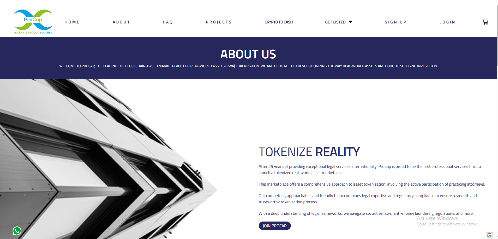

The platform implements a comprehensive workflow from whitelisting to profit distribution:

- Property owners get whitelisted and create tokenization projects with defined parameters
- Platform reviews and approves projects before opening to investors 
- Investors can purchase tokens representing shares in approved projects
- Owners manage development and property sale
- Smart contracts handle automatic profit distribution based on token ownership

The system leverages ERC-1155 token standard to enable semi-fungible tokenization of real estate assets, combining the benefits of both fungible and non-fungible tokens.

- Live Link: <a href="https://procap.global/platform">ProCap</a>

 

<h3><u><strong><i>Pump.fun - Ape.lol</i></strong></u> &nbsp;(Solana/Ethereum)</h3>

This is pump.fun project on Solana/Ethereum network. Launch a coin that is instantly tradable without having to seed liquidity.  

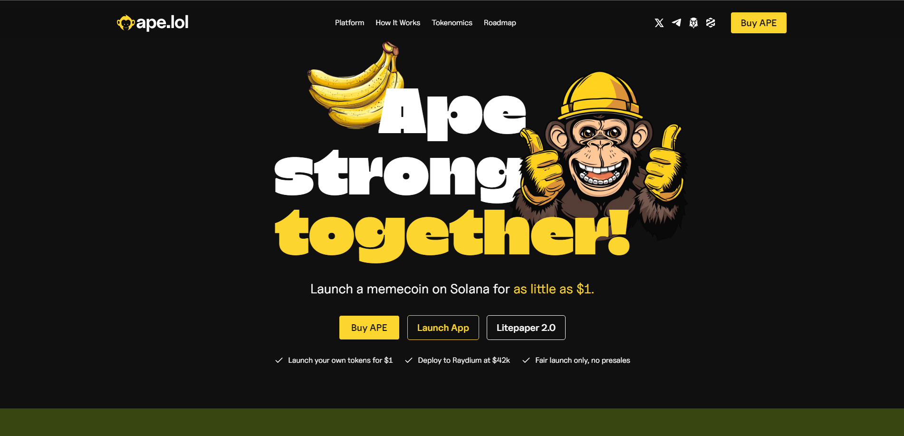

Implemented Bonding Curve mechanism and forked pumpfun. Developed smart contract using Anchor. 

* Built Boilerplate for all other forking project 
* Built frontend/backend for spl token create, market create. 
* Built smart contract for bonding curve, make pool on raydium. 
 

- Live: <a href="https://app.ape.lol/">Pump Fun</a>
- Github repos: 
  - Smart Contract repo: <a href="https://github.com/eross220/Pumpfun-Ape.lol">Pump.fun-Smart Contract</a>

<h3><u><strong><i>Infinite Money Glitch ($IMG)</i></strong></u> &nbsp;(Solana)</h3>

Infinite Money Glitch ($IMG) is a decentralized finance (DeFi) project built on the Solana blockchain. 

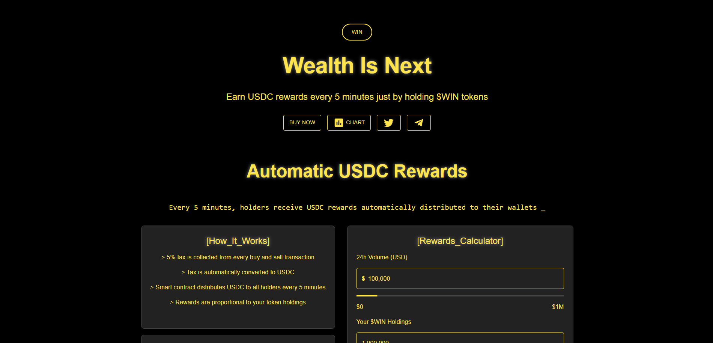
It leverages the advanced tax extension capabilities of the Token2022 program to create a unique reward system for token holders. 
 
The $IMG project implements a seamless 5% tax on all transactions, including buying, selling, and transferring tokens. This tax is automatically collected and distributed to token holders in SOL, providing them with a sustainable passive income stream. The reward distribution is proportional to the holding size, meaning that the more $IMG tokens a holder has, the higher their SOL yield. 
 

- Live: <a href="https://infinite-money-glitch.vercel.app/">Infinite Money Glitch</a>
- Github repo: <a href="https://github.com/eross220/Infinite-Money-Glitch">IMG Landing Page</a>

<h3><u><strong><i>Coinflip Game</i></strong></u> &nbsp;(Solana)</h3>

This is the Coinflip game for Solana network.
Developed Smart Contract using anchor.
 

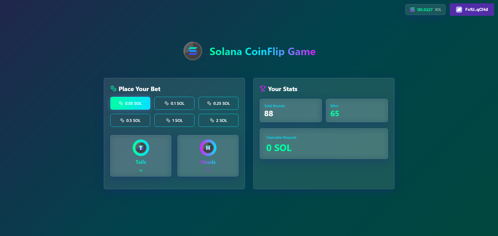

- Original Link: <a href="https://coinflip.deezkits.com/" target="_blank">Coinflip Game</a>

- Live: <a href="https://solana-coinflip-game-two.vercel.app/">Devnet Live Game</a>
  - You can play game in Solana Devenet

- Github repo: <a href="https://github.com/eross220/Solana-Coinflip-Game">Solana Coinflip Game</a>

- Social Link: <a href="https://mobile.twitter.com/deezkits" target="_blank">Deezkits-twitter</a>

 

<h3><u><strong><i>Mirage Token Launchpad</i></strong></u> &nbsp;(Solana)</h3>

This is a token launchpad application for the Solana blockchain that enables users to easily create custom SPL tokens.

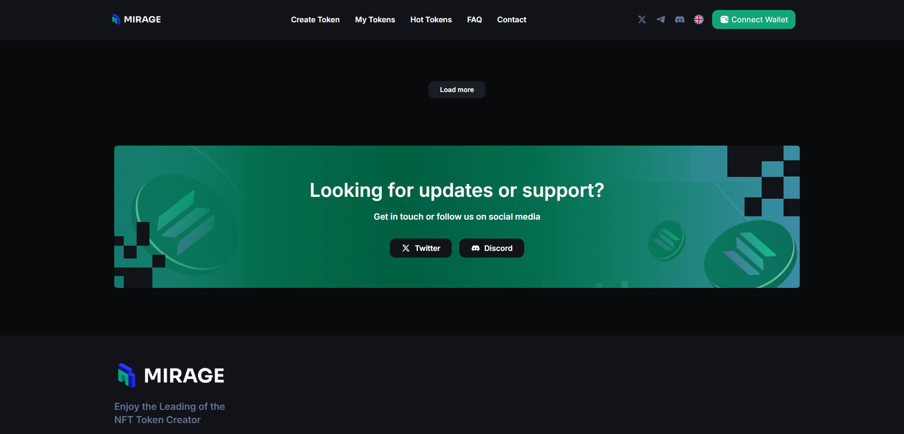

-  The platform provides a simple interface for token creation and deployment on Solana.
    - Create custom SPL tokens on Solana
    - Simple and intuitive interface
    - Beta version currently available

- Github repo: <a href="https://github.com/eross220/Solana-Token-Launchpad" target="_blank">Solana Token Launchpad</a>
- Live link: <a href = "https://mirage-token-launchpad.vercel.app/">Mirage Pad Vercel</a>

 

<h3><u><strong><i>Flash Launchpad(EVM)</i></strong></u></h3>

Flash is a leading decentralized launchpad platform that enables users to create tokens and launch initial token sales without coding knowledge. 
The platform has facilitated over $20M in fundraising across 100+ projects and attracts millions of monthly investors. 

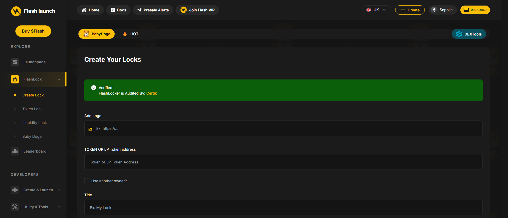

- Key features:
  - No-code token creation and sale launch
  - Strict KYC procedures for investor protection
  - Safe and secure investment environment
  - Track record of successful token launches

- Live: <a href="https://flash-launch.com/">Flash Launchpad</a>
- Github repo: <a href="https://github.com/eross220/flash-launchpad">Flash Launchpad</a>

 

<h3><u><strong><i>Multilyser</i></strong></u></h3>

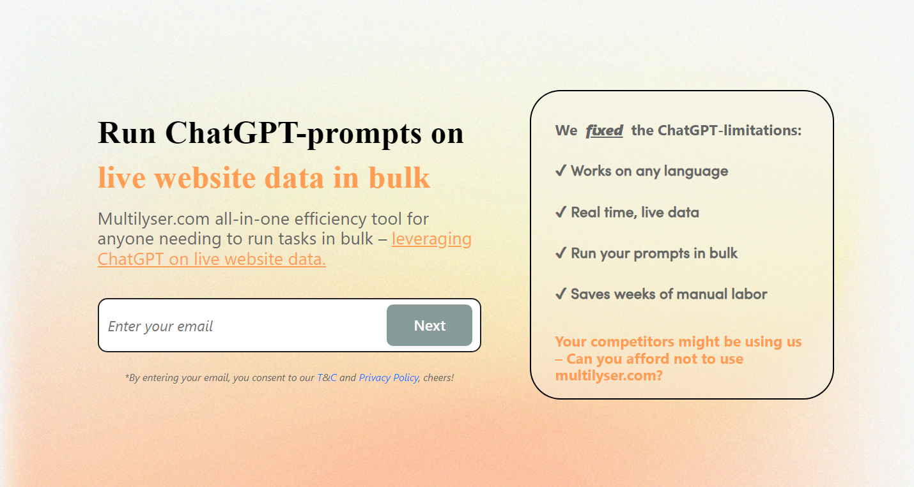

Multilyser is ChatGPT powered Website summarization system. 
The project implements data extraction using web scraping and summarizes website contents using LLM technology. It provides great insights about websites by combining web scraping capabilities with OpenAI's GPT.

- Live: <a href="https://multilyser.com">Multilyser</a>
- Github repo: <a href="https://github.com/eross220/multilyser.com">Multilyser</a>

 

<h3><u><strong><i>MuchbetterAI</i></strong></u></h3>

MuchbetterAI is a most immersive platform for sales ramp-up.
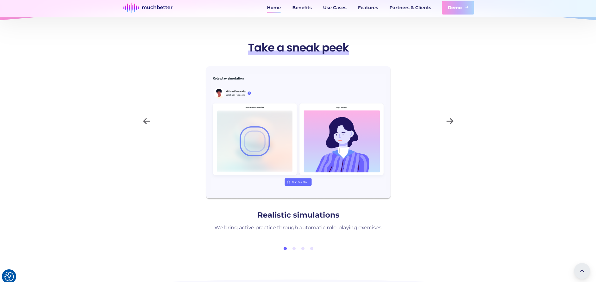
  Simulations with AI-generated clients for a much better training experience and higher sales outcomes
  The project leverages OpenAI's GPT to create realistic AI-simulated client interactions and implements a sophisticated RAG pipeline.
  

 

- Live: <a href="https://muchbetter.ai">MuchbetterAI</a>
- Github repo: <a href="https://github.com/eross220/muchbetter-ai">MuchbetterAI</a>

 
 

<h3><u><strong><i>AdaletGPT</i></strong></u></h3>

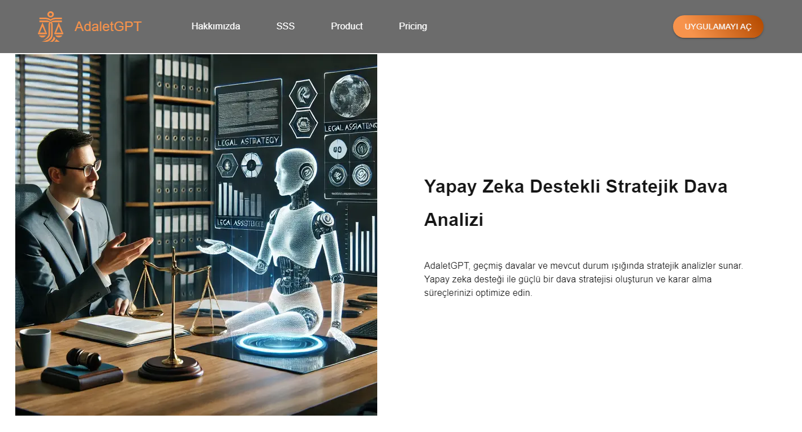

AdaletGPT is a Turkish Legal chatbot built on a RAG (Retrieval Augmented Generation) pipeline. The system utilizes LangChain, OpenAI embeddings, and Pinecone vector store to enhance the performance and customization of large language model (LLM) applications through custom data integration.

- Live: <a href="https://adaletgpt.com">AdaletGPT</a>
- Github repo: <a href="https://github.com/eross220/adaletgpt">AdaletGPT</a>
 

<h3><u><strong><i>Jackpot Game</i></strong></u> &nbsp;(Solana)</h3>

The Slowrug is a kind of Jackpot game which has initially 3 rooms (Tower, Graveyard, Infinite).
The players can enter in the game with their own bet amount and after the game finished, the winner can get the whole bet value from the platform.

- Original Link: <a href="https://slowrug.io/" target="_blank">Slowrug</a>
  - You can play game with SOL with this site
  - You can win and get the whole bet amount

- Github repo: <a href="https://github.com/eross220/Solana-Jackpot-Game">JackPot Game</a>
 

<h3><u><strong><i>Smartgen</i></strong></u></h3>

Smartgen is an Enterprise RAG chatbot solution designed to serve multiple clients. 

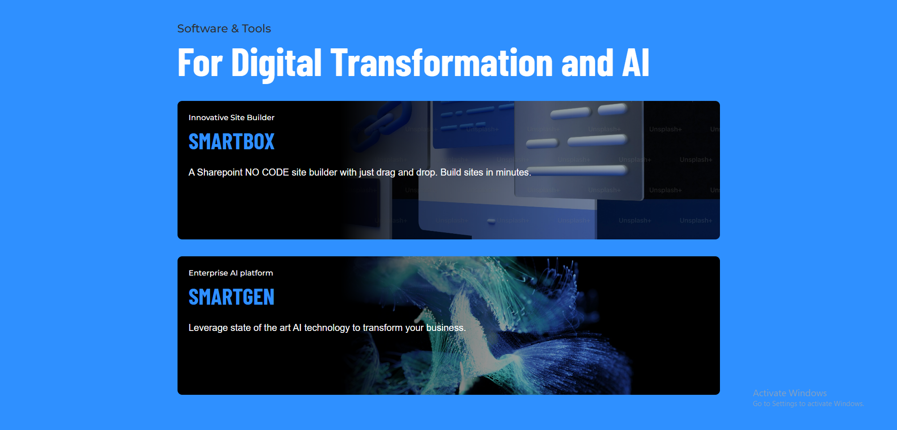

The platform leverages state-of-the-art AI technology to transform businesses through intelligent automation and data processing. 

The system implements an advanced RAG (Retrieval Augmented Generation) pipeline to provide accurate and contextually relevant responses while maintaining data security and customization for each client.

- Live: <a href="https://w3bvolution.com/">Smartgen</a>
- Github repo: <a href="https://github.com/eross220/Smartgen">Smartgen</a>

 

<h3><u><strong><i>Chicken Derby AI</i></strong></u></h3>

Chicken Derby AI is an OpenAI-powered Race commentary generator that creates dynamic and engaging commentary for racing events. 

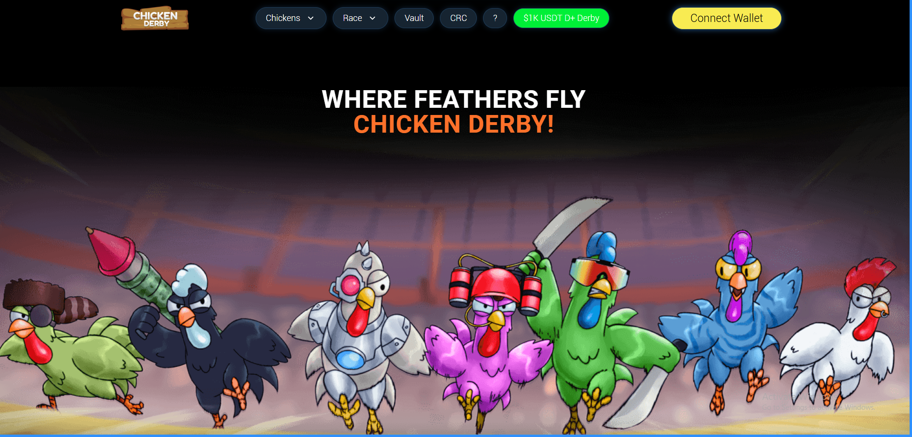

The system leverages OpenAI's language models to generate real-time, contextual race commentary, providing an immersive experience for racing enthusiasts. 

- Live: <a href="https://www.chickenderby.com/">Chicken Derby AI</a>
- Github repo: <a href="https://github.com/eross220/Chicken-Derby_AI">Chicken Derby AI</a>

 
